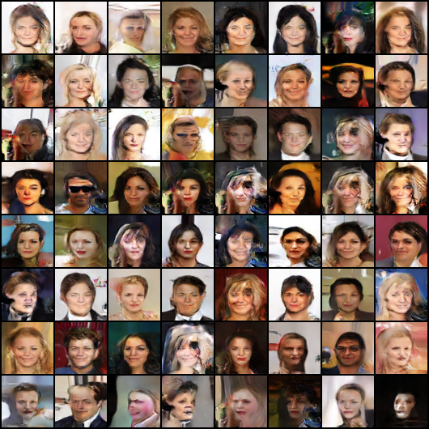
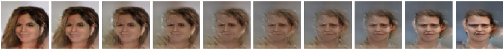
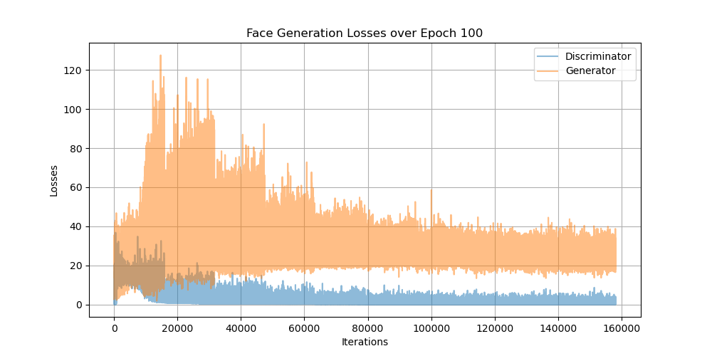

This folder contains the implementation of EBGAN.

### 0. Introduction
- EBGAN: [Energy-based Generative Adversarial Network](https://arxiv.org/pdf/1609.03126.pdf)


### 1. Results
1) Qualitative Analysis



2) Quantative Analysis

| Model | IS↑ | FID↓ |
|:-----:|:-----:|:-----:|
| EBGAN | 2.499 ± 0.0186 | 4.946 |

3) Interpolation



### 1. Dataset
Download the CelebA dataset from this [link](http://mmlab.ie.cuhk.edu.hk/projects/CelebA.html).
After downloading the dataset, please check if the directory corresponds to below:
```
+---[celeba]
|     \---[img_align_celeba]
|         +---[000001.jpg]
|         |...
|         +---[202599.jpg]
+---celeba.py
+---config.py
|   ...
+---walking in the latent space.ipynb
```

### 2. Run the Codes
1) Train
```
python train.py
```

2) Interpolation (so-called 'Walking in the latent space')

Place the pre-trained weights to `./results/weights` and run `walking in the latent space.ipynb`.

3) Generate faces (for inference)
```
python generate_faces.py
```

4) Inception Score
```
python inception_score.py
```

4) Calculate FID (Frechet Inception Distance) Score
```
python fid_score.py './celeba/img_align_celeba/ './results/inference/inference/'
```

### 3. Plot Loss

